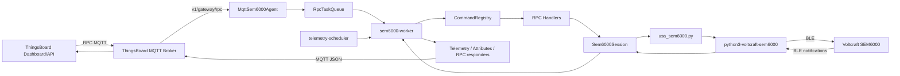

# Arquitectura i funcionament intern del bridge SEM6000 MQTT

Data de l'actualitzacio: 2026-05-14

Fitxer principal explicat: `codis/usa_sem6000_thingsboard_mqtt.py`

Aquest document explica com funciona el codi per dins. La idea no es nomes saber
executar-lo, sino entendre quines peces hi ha, com es comuniquen, quin estat
guarden i on s'hauria de tocar si algun dia cal ampliar-lo o arreglar-lo.

## 1. Que fa aquest programa

`usa_sem6000_thingsboard_mqtt.py` es un agent de llarga durada que fa de
passarella entre un endoll Voltcraft SEM6000 i ThingsBoard.

El SEM6000 parla per Bluetooth Low Energy, pero ThingsBoard parla amb el mon
exterior per MQTT. El programa queda al mig i fa tres feines principals:

1. Llegeix mesures i estat de l'endoll per BLE.
2. Publica telemetria, atributs i diagnostics a ThingsBoard per MQTT.
3. Rep ordres RPC de ThingsBoard, les tradueix a operacions BLE i retorna una
   resposta JSON.

El mode MQTT utilitzat es el mode gateway de ThingsBoard. Aixo vol dir que el
client MQTT autenticat es el gateway, pero les dades principals es publiquen en
nom d'un dispositiu fill, el SEM6000.

## 2. Fitxers importants del projecte

| Fitxer | Paper |
| --- | --- |
| `codis/usa_sem6000_thingsboard_mqtt.py` | Runtime principal. Conte configuracio, MQTT, cua RPC, sessio BLE, handlers i telemetria. |
| `codis/usa_sem6000.py` | Wrapper petit que posa al `sys.path` la llibreria local `python3-voltcraft-sem6000` i exposa funcions basiques. |
| `codis/usa_sem6000_thingsboard.py` | Versio antiga HTTP/long polling. Es mante com a referencia, pero el runtime recomanat es el MQTT. |
| `codis/tests/test_usa_sem6000_thingsboard_mqtt.py` | Tests unitaris del bridge MQTT: normalitzacio, cues, handlers, payloads i pegats BLE. |
| `codis/docs/guia_thingsboard_sem6000.md` | Guia operativa per configurar dashboards i widgets de ThingsBoard. |
| `codis/docs/bridge_mqtt_sem6000_thingsboard.md` | Auditoria historica de capacitats del bridge. |

## 3. Arquitectura general



La separacio important es aquesta:

- `MqttSem6000Agent` coordina tot el proces.
- `RpcTaskQueue` desacobla els callbacks MQTT del treball BLE real.
- `Sem6000Session` es l'unica porta d'entrada al dispositiu BLE.
- Els `RpcHandler` tradueixen metodes RPC concrets a crides de negoci.
- Els publishers construeixen el format JSON que ThingsBoard espera.

## 4. Components principals

### 4.1 `AppConfig`

`AppConfig` es una dataclass immutable carregada preferentment des d'un fitxer
TOML amb `AppConfig.from_sources()`. Si no hi ha fitxer a
`/etc/sem6000-bridge/config.toml`, encara pot carregar configuracio des de
variables d'entorn amb `AppConfig.from_env()`.

Guarda tota la configuracio efectiva:

- adreca MAC i PIN del SEM6000
- host MQTT, ports, TLS i keepalive
- token gateway i client id
- nom i tipus del dispositiu fill
- QoS de control i telemetria
- intervals de telemetria
- mida maxima de la cua RPC
- timeouts BLE normals i d'historics
- adaptador BLE (`hci0`, `hci1`, etc.)
- flag d'activacio de RPCs administratives
- nivell de log

La MAC del SEM6000 i el token gateway ja no estan fixats al codi. El fitxer TOML
pot contenir diversos endolls sota `[devices.*]` i `active_device` selecciona
quin s'usa en aquella execucio.

### 4.2 `MqttSem6000Agent`

Es la classe central. Crea i connecta el client MQTT, instancia la sessio BLE,
registra handlers RPC i arrenca els fils interns.

Responsabilitats principals:

- crear el client `paho-mqtt`
- connectar a ThingsBoard amb TLS, plain o fallback
- subscriure's a `v1/gateway/rpc` i `v1/gateway/attributes`
- publicar l'alta i baixa del dispositiu fill
- publicar atributs estatics i diagnostics
- rebre RPCs, validar-los i posar-los a cua
- executar la cua i la telemetria periodica des del worker
- parar ordenadament MQTT i BLE

`MqttSem6000Agent` no fa directament operacions concretes com "canviar PIN" o
"afegir scheduler". Per aixo delega en handlers.

### 4.3 `AgentState`

`AgentState` es l'estat runtime compartit:

- `plug_is_on`: ultim estat ON/OFF conegut
- `last_power_w`: ultima potencia coneguda
- `last_telemetry_ts_ms`: timestamp de l'ultima telemetria enviada
- `mqtt_connected`: estat MQTT actual
- `last_rpc_total_ms`: durada de l'ultima RPC processada

Aquest estat evita lectures BLE innecessaries. Per exemple, si l'endoll ja se
sap apagat, la telemetria publica `power_w=0.0` i `plug_on=false` sense demanar
una mesura BLE cada segon.

### 4.4 `RpcTask` i `RpcTaskQueue`

Una RPC entrant es transforma en un `RpcTask`:

- `request_id`
- `device_name`
- `method`
- `params`
- `coalesce_key`

La cua es thread-safe i fa dues coses importants:

1. Limita la mida maxima amb `RPC_QUEUE_SIZE`.
2. Aplica coalescing a ordres de potencia.

El coalescing vol dir que si arriben diverses ordres mutadores de potencia
seguides, nomes interessa l'ultima. Les anteriors es treuen de la cua i es
responen amb error funcional `superseded`.

Si la cua esta plena, es descarten les tasques mes antigues i es responen amb
`queue_overflow`.

### 4.5 `Sem6000Session`

`Sem6000Session` encapsula tota la relacio amb el dispositiu BLE.

Es la capa que:

- importa `usa_sem6000` de manera lazy
- crea l'objecte `sem6000.SEM6000`
- aplica pegats a la llibreria base
- assegura que nomes hi hagi una operacio BLE alhora
- reconnecta i reintenta una vegada quan una operacio falla
- converteix errors BLE a `CommandError(code="ble_error")`
- exposa metodes d'alt nivell com `set_power`, `request_settings`,
  `request_scheduler`, `reset_pin`, etc.

Totes les crides BLE passen per `_run_ble()`. Aixo es deliberat: concentra en
un sol lloc el lock, la reconnexio, el timeout, el mesurament de durada i la
conversio d'errors.

### 4.6 Publishers

Hi ha quatre classes petites que nomes saben publicar en el format correcte:

| Classe | Que publica |
| --- | --- |
| `TelemetryPublisher` | Telemetria del dispositiu fill a `v1/gateway/telemetry`. |
| `AttributesPublisher` | Client attributes del dispositiu fill a `v1/gateway/attributes`. |
| `RpcResponder` | Respostes success/error a `v1/gateway/rpc`. |
| `GatewayDiagnosticsPublisher` | Atributs i telemetria del gateway mateix a `v1/devices/me/...`. |

Aquestes classes no tenen logica de negoci. Nomes empaqueten JSON i criden
`_publish_json()`.

### 4.7 `CommandRegistry` i handlers RPC

`CommandRegistry` es un mapa de `method` normalitzat cap al handler que sap
processar-lo.

Cada handler declara una tupla `methods` i implementa:

```python
handle(method_name, params, context) -> dict
```

`CommandContext` dona als handlers tot el que necessiten:

- `sem`: sessio BLE
- `state`: estat runtime
- `telemetry`: publicador de telemetria del fill
- `attributes`: publicador d'atributs del fill
- `config`: configuracio efectiva

## 5. Model de fils i concurrencia

El programa treballa amb diversos fils:

| Fil | Origen | Responsabilitat |
| --- | --- | --- |
| Fil principal | `run_forever()` | Mantenir viu el proces i atendre senyals d'aturada. |
| Fil MQTT intern | `paho-mqtt` | Gestionar connexio, subscripcions i callbacks `on_message`. |
| `sem6000-worker` | creat per l'agent | Executar RPCs i lectures de telemetria. |
| `telemetry-scheduler` | creat per l'agent | Marcar quan toca una lectura periodica i publicar diagnostics. |

La decisio clau es que els callbacks MQTT no fan treball BLE. Nomes validen la
RPC i l'afegeixen a `RpcTaskQueue`. La BLE queda concentrada al worker.

Locks i events importants:

- `_publish_lock`: evita publicacions MQTT simultanies desordenades.
- `RpcTaskQueue._condition`: coordina productor MQTT i consumidor worker.
- `Sem6000Session._lock`: serialitza totes les operacions BLE.
- `_stop_event`: senyal global d'aturada.
- `_telemetry_pending`: demana al worker que faci una lectura de telemetria.
- `_connected_event` i `_connect_failed_event`: sincronitzen la connexio MQTT.

## 6. Arrencada del programa

El punt d'entrada es `main()`:

1. Carrega `AppConfig.from_env()`.
2. Configura logging.
3. Crea `MqttSem6000Agent`.
4. Instal.la handlers de senyal (`SIGINT`, `SIGTERM`).
5. Crida `agent.run_forever()`.
6. En sortir, sempre executa `agent.stop()`.

`agent.start()` fa:

1. `_connect_mqtt()`.
2. Marca una primera telemetria pendent.
3. Arrenca `sem6000-worker`.
4. Arrenca `telemetry-scheduler`.

La connexio MQTT intenta TLS o plain segons `THINGSBOARD_TLS_MODE`:

- `required`: nomes TLS.
- `disabled`: nomes plain.
- `fallback`: primer TLS i, si falla, plain.

Quan el broker accepta la connexio, `_on_connect()`:

1. marca `mqtt_connected=True`
2. subscriu topics RPC i attributes
3. publica `v1/gateway/connect` pel dispositiu fill
4. publica atributs estatics del dispositiu fill
5. publica atributs estatics del gateway
6. publica diagnostics inicials

## 7. Topics MQTT utilitzats

| Topic | Direccio | Us |
| --- | --- | --- |
| `v1/gateway/connect` | bridge -> ThingsBoard | Dona d'alta o anuncia el dispositiu fill. |
| `v1/gateway/disconnect` | bridge -> ThingsBoard | Informa que el dispositiu fill es desconnecta. |
| `v1/gateway/telemetry` | bridge -> ThingsBoard | Telemetria del SEM6000 com a dispositiu fill. |
| `v1/gateway/attributes` | bridge -> ThingsBoard i ThingsBoard -> bridge | Atributs del fill. Els updates entrants s'ignoren. |
| `v1/gateway/rpc` | bidireccional | RPCs entrants i respostes del bridge. |
| `v1/devices/me/telemetry` | bridge -> ThingsBoard | Diagnostics del gateway autenticat. |
| `v1/devices/me/attributes` | bridge -> ThingsBoard | Atributs estatics del gateway. |

El bridge ignora els updates entrants a `v1/gateway/attributes`. La configuracio
real del SEM6000 es canvia per RPC, no escrivint atributs.

## 8. Flux complet d'una RPC

Exemple: un widget envia `setPower` al dispositiu fill.

1. ThingsBoard publica al topic `v1/gateway/rpc`.
2. `paho-mqtt` crida `_on_message()`.
3. `_on_message()` descodifica JSON.
4. `parse_gateway_rpc_payload()` valida estructura:
   - ha de ser un objecte JSON
   - ha de tenir `device`
   - `device` ha de coincidir amb el dispositiu fill esperat
   - `data` ha de ser objecte
   - `data.id` i `data.method` son obligatoris
5. Es crea un `RpcTask`.
6. `RpcTaskQueue.put()` l'afegeix a cua.
7. Si substitueix una ordre de potencia anterior, aquesta rep `superseded`.
8. El `sem6000-worker` treu la tasca de la cua.
9. `_handle_rpc_task()` busca handler al `CommandRegistry`.
10. El handler valida `params`.
11. El handler crida `context.sem...`.
12. `Sem6000Session` fa l'operacio BLE amb lock i reintent.
13. El handler actualitza estat, atributs o telemetria si cal.
14. `RpcResponder.success()` publica la resposta a `v1/gateway/rpc`.

La forma general d'una resposta correcta es:

```json
{
  "device": "sem6000-b30000003043",
  "id": 7,
  "data": {
    "success": true,
    "data": {
      "plug_on": true
    }
  }
}
```

La forma general d'una resposta d'error es:

```json
{
  "device": "sem6000-b30000003043",
  "id": 7,
  "data": {
    "success": false,
    "error": "El metode necessita un parametre boolea.",
    "code": "invalid_params"
  }
}
```

Codis d'error habituals:

- `invalid_request`: estructura RPC incorrecta.
- `wrong_device`: RPC adrecada a un altre dispositiu fill.
- `invalid_params`: metode correcte pero parametres incorrectes.
- `unknown_method`: method no registrat.
- `ble_dependency_error`: no es pot importar la llibreria BLE.
- `ble_error`: error real parlant amb el SEM6000.
- `queue_overflow`: cua plena.
- `superseded`: ordre substituida per una mes recent.
- `internal_error`: excepcio no prevista.
- `stopping`: operacio cancel.lada durant l'aturada.

## 9. Flux complet de telemetria periodica

La telemetria no surt directament del scheduler. El scheduler nomes marca feina
pendent i el worker la fa quan no hi ha RPCs acumulades.

Flux:

1. `telemetry-scheduler` espera l'interval actual.
2. Si toca, publica diagnostics del gateway cada 30 segons.
3. Si hi ha RPCs a la cua, no demana telemetria encara.
4. Si la cua esta buida, activa `_telemetry_pending`.
5. `sem6000-worker` veu `_telemetry_pending` i crida `_handle_telemetry_tick()`.
6. Si `plug_is_on` es `False`, publica directament:

```json
{
  "power_w": 0.0,
  "plug_on": false
}
```

7. Si no se sap que esta apagat, demana `request_measurement()` per BLE.
8. `map_measurement_to_values()` converteix la notificacio BLE a claus
   ThingsBoard.
9. Si canvia `plug_on`, tambe es publica com a atribut.
10. Es publica telemetria a `v1/gateway/telemetry`.

Intervals:

- si l'endoll esta actiu o desconegut: `telemetry_interval_on_seconds`
- si l'endoll esta apagat: `off_heartbeat_seconds`

Per defecte son 1 segon actiu i 30 segons apagat.

## 10. Claus de telemetria i atributs

Telemetria del dispositiu fill:

| Clau | Origen | Notes |
| --- | --- | --- |
| `power_w` | `power_in_milliwatt / 1000` | Arrodonit a 3 decimals. |
| `plug_on` | `is_power_active` | Tambe es publica immediatament quan una RPC canvia potencia. |
| `voltage_v` | `voltage_in_volt` | Nomes quan toca publicar mesures esteses. |
| `current_a` | `current_in_milliampere / 1000` | Arrodonit a 3 decimals. |
| `frequency_hz` | `frequency_in_hertz` | Arrodonit a 3 decimals. |
| `energy_total_kwh` | `total_consumption_in_kilowatt_hour` | Arrodonit a 6 decimals. |

Les mesures esteses es publiquen quan:

- l'endoll esta actiu, o
- `ENABLE_EXTENDED_MEASUREMENTS=true`.

Atributs del dispositiu fill:

- `sem6000_address`
- `bridge`
- `gateway_client_id`
- `plug_on`
- `night_mode`
- `power_limit_w`
- `price_normal_cent`
- `price_reduced_cent`
- `reduced_period_enabled`
- `reduced_period_start`
- `reduced_period_end`
- `device_name`
- `timer_active`
- `timer_action`
- `timer_target_isodatetime`
- `timer_original_length_seconds`
- `random_mode_enabled`
- `random_mode_weekdays`
- `random_mode_start`
- `random_mode_end`

Diagnostics del gateway:

- `mqtt_connected`
- `ble_connected`
- `rpc_queue_depth`
- `last_ble_op_ms`
- `last_rpc_total_ms`

## 11. Normalitzacio de dades

Una part grossa del fitxer existeix per fer estable el contracte JSON entre
ThingsBoard i el SEM6000.

Funcions importants:

| Funcio | Paper |
| --- | --- |
| `parse_boolean_value()` | Accepta booleans, enters, strings i objectes comuns com `{ "enabled": true }`. |
| `_normalize_isotime_minutes()` | Valida hores `HH:MM` o `HH:MM:SS` i retorna `HH:MM`. |
| `_normalize_isodatetime_seconds()` | Valida dates `YYYY-MM-DDTHH:MM[:SS]` i retorna segons. |
| `_normalize_positive_int()` | Valida enters positius, amb opcio d'acceptar zero. |
| `_normalize_weekdays_string()` | Accepta dies en CSV o llista i retorna `Mon,Wed,Fri`. |
| `_normalize_action_label()` | Converteix accions a `on` o `off`. |
| `map_measurement_to_values()` | Tradueix lectures SEM6000 a telemetria ThingsBoard. |
| `normalize_settings_notification()` | Tradueix settings BLE a JSON estable. |
| `flatten_settings_attributes()` | Aplana settings per publicar-los com atributs. |
| `normalize_scheduler_notification()` | Ordena i normalitza schedulers. |
| `normalize_consumption_*_notification()` | Dona forma JSON als historics 23h, 30d i 12m. |

La norma general del codi es: els handlers no retornen objectes propis de la
llibreria BLE. Sempre retornen diccionaris JSON-compatibles.

## 12. Pegats aplicats a la llibreria SEM6000

`Sem6000Session._patch_sem6000_delegate()` aplica pegats runtime a la llibreria
base. Aquests pegats son importants per robustesa.

### 12.1 Final correcte de notificacions llargues

La llibreria base podia donar una resposta per completa nomes perque un fragment
acabava en `ff ff`. Aixo falla amb historics llargs, perque un fragment
intermedi tambe pot acabar igual.

El bridge implementa `sem6000_raw_notifications_complete()` per decidir si el
missatge complet ja ha arribat mirant:

- byte inicial `0x0f`
- longitud declarada pel payload
- checksum
- sufix esperat

### 12.2 Parser tolerant per historics HW v3

Alguns SEM6000 hardware v3 retornen historics amb checksum anomal pero amb forma
de payload correcta. El codi ho accepta nomes per formes esperades:

- historic 23 hores
- historic 30 dies
- historic 12 mesos

Aquesta tolerancia esta acotada per evitar acceptar missatges arbitraris.

### 12.3 Espera de BLE amb polling curt

`wait_for_sem6000_notifications()` evita tallar massa aviat una resposta
fragmentada. Quan ja hi ha dades parcials, continua fent polls curts fins que
el missatge sigui complet o s'esgoti una finestra de gracia.

### 12.4 Historics amb timeout mes llarg

Les lectures d'historics fan servir `sem6000_history_timeout_seconds`, per
defecte 12 segons, perque son respostes BLE mes llargues que una lectura
instantania.

## 13. Handlers RPC disponibles

| Handler | Methods | Responsabilitat |
| --- | --- | --- |
| `PowerHandler` | `setPower`, `setSwitch`, `setRelay`, `power`, `powerOn`, `powerOff`, `on`, `off`, `getPowerState`, `getSwitchState` | Control ON/OFF i estat de l'endoll. |
| `MeasurementHandler` | `getMeasurement`, `measure`, `syncTime`, `setTime` | Lectura instantania i sincronitzacio de rellotge. |
| `ConfigurationHandler` | `getSettings`, `setNightMode`, `setPowerLimit`, `setPrices`, `setReducedPeriod` | Settings interns del SEM6000. |
| `IdentityHandler` | `getDeviceName`, `setDeviceName`, `getDeviceSerial` | Nom visible i serial del dispositiu. |
| `TimerHandler` | `getTimer`, `setTimer`, `resetTimer` | Timer unic del SEM6000. |
| `RandomModeHandler` | `getRandomMode`, `setRandomMode`, `resetRandomMode` | Mode aleatori per dies i franja horaria. |
| `ScheduleHandler` | `getScheduler`, `getSchedulers`, `addScheduler`, `editScheduler`, `addOnetimeScheduler`, `editOnetimeScheduler`, `addRepeatedScheduler`, `editRepeatedScheduler`, `removeScheduler` | Gestio completa de schedulers. |
| `ConsumptionHandler` | `getConsumption23h`, `getConsumption30d`, `getConsumption12m`, `resetConsumption` | Historics de consum i reset de comptador. |
| `AdministrativeHandler` | `adminChangePin`, `adminResetPin`, `adminFactoryReset` | Operacions sensibles de manteniment. |

Cada handler segueix el mateix patro:

1. Normalitza `method_name`.
2. Decideix quin subcas aplica.
3. Valida `params`.
4. Crida `context.sem`.
5. Actualitza `context.state`, atributs o telemetria si toca.
6. Retorna un diccionari JSON.
7. Llenca `CommandError` quan l'error es funcional i s'ha de retornar al client.

## 14. Com es publiquen resultats immediats

Algunes RPCs no es limiten a respondre. Tambe publiquen estat per mantenir el
dashboard coherent.

Exemples:

- `setPower(false)` publica `plug_on=false` com atribut i telemetria
  `power_w=0.0`.
- `getSettings()` publica els settings aplanats com atributs.
- `setNightMode()` actualitza l'atribut `night_mode`.
- `getDeviceName()` i `setDeviceName()` actualitzen `device_name`.
- `getTimer()`, `setTimer()` i `resetTimer()` actualitzen atributs `timer_*`.
- `getRandomMode()`, `setRandomMode()` i `resetRandomMode()` actualitzen
  atributs `random_mode_*`.

En canvi, schedulers i historics de consum es retornen per RPC pero no es
publiquen com telemetria ni atributs. Son respostes sota demanda.

## 15. Criteris de disseny que segueix el codi

El codi te diverses decisions que val la pena mantenir:

- Les operacions BLE estan serialitzades. El SEM6000 no s'ha de tractar com si
  fos concurrent.
- Les RPCs no s'executen dins del callback MQTT.
- Les respostes RPC tenen sempre una forma `success/data` o `success/error/code`.
- Les dades publicades a ThingsBoard son JSON senzill, no objectes de la
  llibreria base.
- Les ordres de potencia a cua fan politica "l'ultima guanya".
- Les lectures periodiques cedeixen prioritat a RPCs pendents.
- Els errors esperats es representen amb `CommandError` i codi controlat.
- Els historics llargs tenen timeout i parser especials.

## 16. Com afegir una nova funcionalitat

Si un dia la llibreria SEM6000 exposa una nova operacio, el cami recomanat es:

1. Afegir un metode a `Sem6000Session` que embolcalli la crida BLE amb `_run_ble()`.
2. Si la resposta BLE no es JSON-friendly, crear una funcio `normalize_*`.
3. Crear o ampliar un handler RPC.
4. Afegir el nom del metode a la tupla `methods`.
5. Si es un handler nou, registrar-lo a `MqttSem6000Agent.__init__()`.
6. Publicar atributs o telemetria nomes si la dada ha de quedar visible com a
   estat actual o serie temporal.
7. Afegir tests a `codis/tests/test_usa_sem6000_thingsboard_mqtt.py`.
8. Actualitzar la guia operativa de ThingsBoard si canvia el contracte RPC.

Regla practica: si una dada es puntual o gran, millor resposta RPC. Si es estat
actual consultable, millor atribut. Si evoluciona amb el temps i interessa
grafica, millor telemetria.

## 17. Tests existents

La suite de tests fa servir stubs i objectes dummy, no un SEM6000 real. Aixo
permet provar la logica del bridge sense Bluetooth ni ThingsBoard.

Tipus de coses cobertes:

- parseig de booleans
- finalitzacio correcta de notificacions BLE llargues
- timeout especial d'historics
- payloads MQTT de telemetria, atributs i RPC
- cua RPC i coalescing
- normalitzacio de settings, timer, random mode, schedulers i historics
- validacio de parametres invalids
- efectes laterals dels handlers sobre estat, atributs i telemetria

Com executar-los habitualment:

```powershell
python -m unittest codis.tests.test_usa_sem6000_thingsboard_mqtt
```

## 18. Punts delicats i coses a vigilar

- El token gateway i la MAC es carreguen de TOML o variables d'entorn. Cal
  protegir `/etc/sem6000-bridge/config.toml` perque conte el token MQTT.
- `adminFactoryReset` i `adminResetPin` deixen el PIN intern a `0000`.
- `factory_reset()` desconnecta BLE per forcar una sessio neta despres del reset.
- El dispositiu fill es filtra pel nom exacte. Si ThingsBoard envia RPCs a un
  altre `device`, el bridge les ignora o les rebutja.
- Els updates entrants d'atributs no canvien el SEM6000.
- Les dates i hores es normalitzen sense zona horaria explicita. Depenen de
  l'hora local de la maquina on corre el bridge.
- `getPowerState` retorna l'estat en cache, no fa una lectura BLE forcada.
- Si l'estat cache diu que l'endoll esta apagat, la telemetria periodica no
  demana mesura BLE fins que una RPC o un canvi d'estat actualitzi el cache.
- Els historics de consum poden trigar mes i necessiten el timeout llarg.
- La reconnexio BLE nomes reintenta una vegada per operacio.

## 19. Model mental curt

Pots pensar el programa aixi:

```text
MQTT callback
    valida JSON
    crea RpcTask
    posa a cua

worker
    si hi ha RPC:
        busca handler
        valida params
        crida Sem6000Session
        respon RPC
    si no hi ha RPC i toca telemetria:
        llegeix o simula estat apagat
        publica telemetria

Sem6000Session
    bloqueja BLE
    assegura connexio
    executa operacio
    si falla, reconnecta i reintenta
    converteix errors a CommandError

publishers
    empaqueten JSON ThingsBoard
    publiquen a topic correcte
```

Amb aquest model, la resta del fitxer encaixa: les funcions de normalitzacio
fan que l'entrada i sortida siguin estables, els handlers defineixen el contracte
funcional, i l'agent nomes coordina fils, MQTT i cicle de vida.
